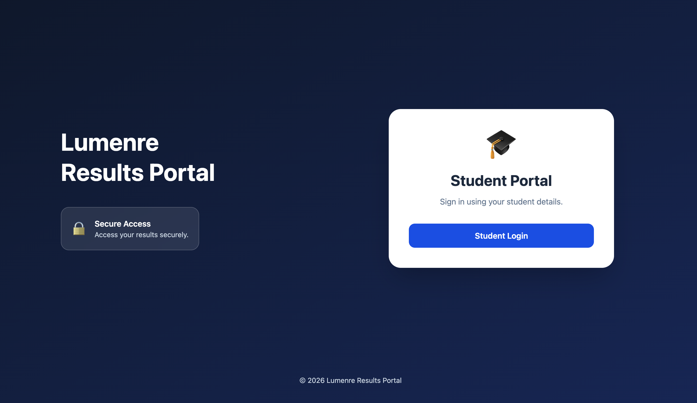
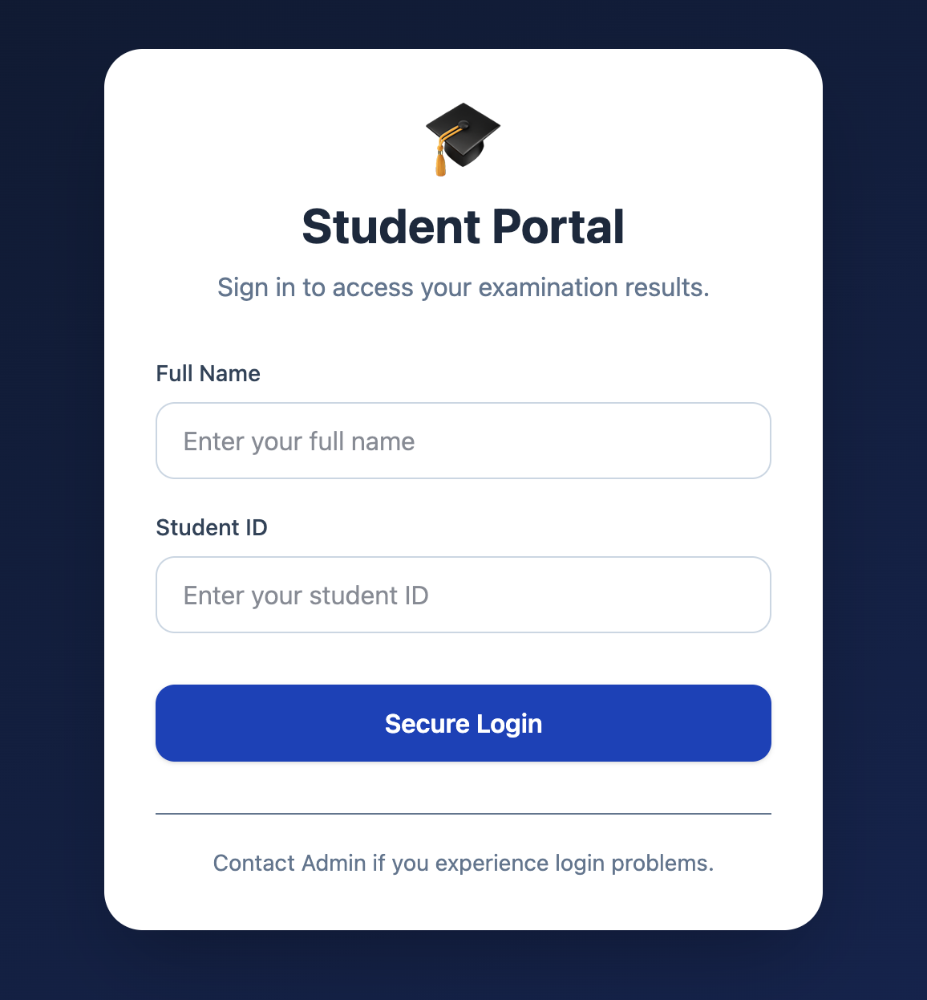
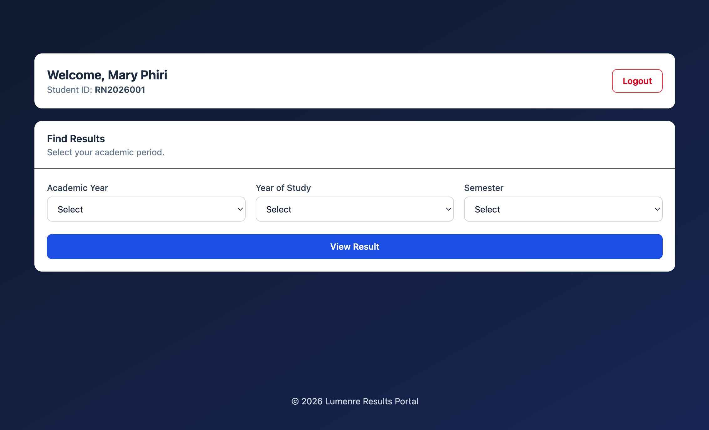
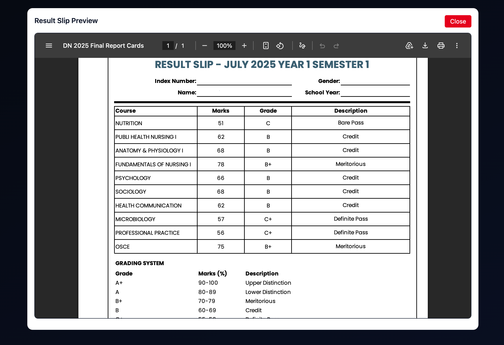
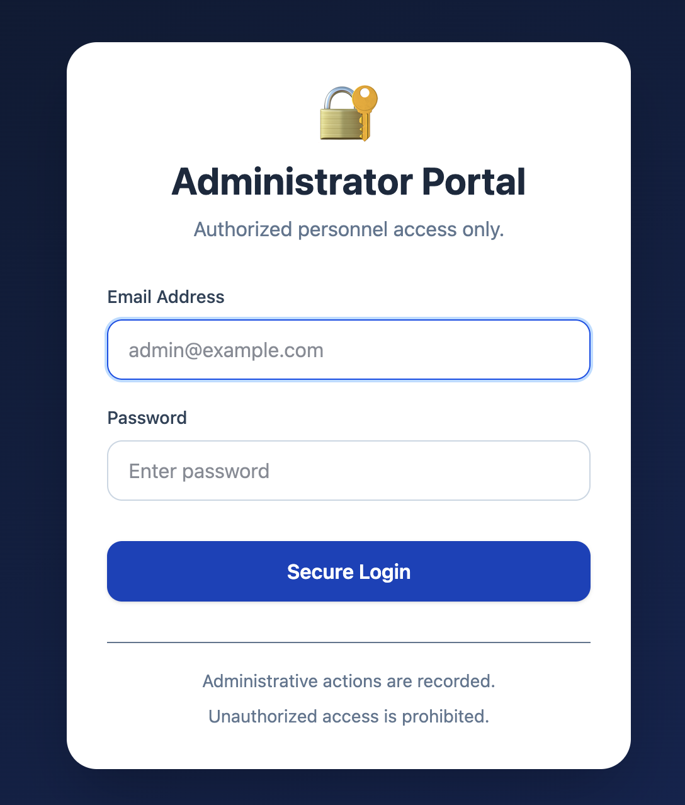
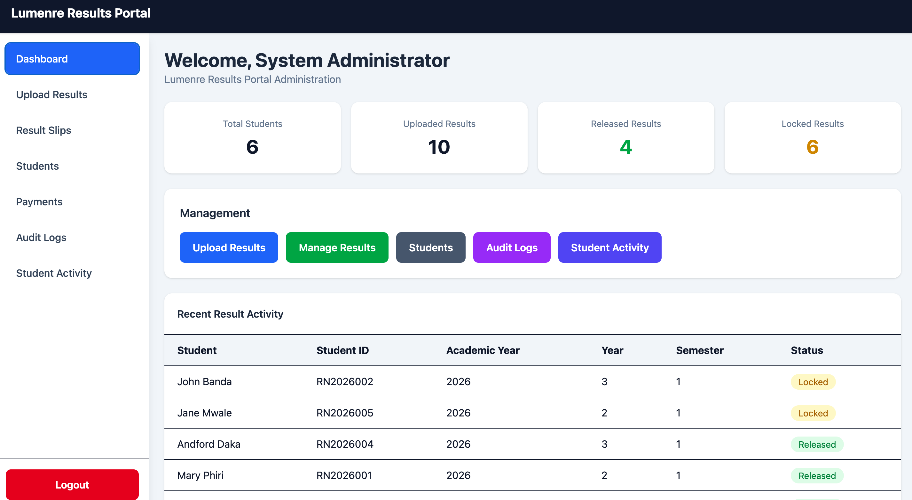
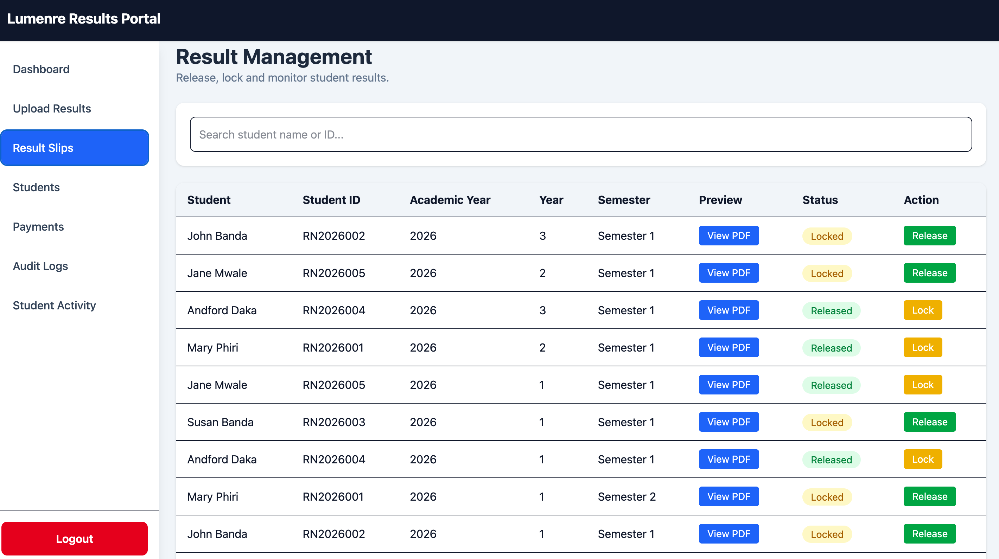
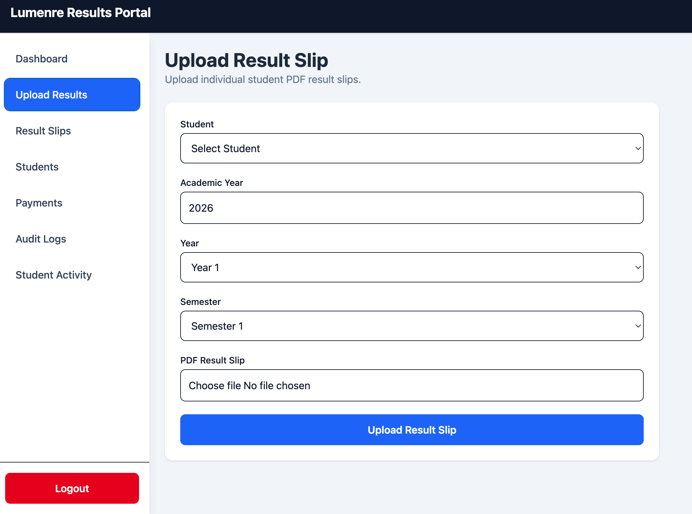

# 🎓 Lumenre Results Portal

<p align="center">


</p>

<p align="center">

A modern, secure, and professional web-based examination results management system built with the MERN Stack.

</p>

<p align="center">


</p>

---

# Table of Contents

* Overview
* Features
* Screenshots
* Technology Stack
* System Architecture
* Project Structure
* User Roles
* Student Workflow
* Administrator Workflow
* Security Features
* Installation
* Environment Variables
* Running the Application
* API Overview
* Database Models
* Folder Structure
* Future Improvements
* Deployment
* Contributing
* License
* Author
* Acknowledgements

---

# Overview

Lumenre Results Portal is a secure examination results management system developed to simplify the uploading, management, release, and viewing of student result slips.

The system provides two independent portals:

* Student Portal
* Administrator Portal

Students can securely access only their own officially released result slips, while administrators manage student records, upload PDF result slips, control result releases, monitor activity, and administer payments.

The application has been designed with a clean institutional interface suitable for colleges, nursing schools, universities, and other higher learning institutions.

---

# Features

## Student Portal

* Secure student authentication
* Personalized dashboard
* Responsive interface
* Search results by:

  * Academic Year
  * Year of Study
  * Semester
* PDF result slip viewer
* Locked result notifications
* Protected student session
* Secure logout

---

## Administrator Portal

* Secure administrator authentication
* Responsive administrator dashboard
* Upload PDF result slips
* Search students instantly
* Preview uploaded PDFs
* Release results
* Lock results
* Student management
* Payment management
* Dashboard statistics
* Recent activity monitoring

---

## Dashboard Features

### Student Dashboard

* Student profile card
* Result search panel
* Professional result viewer
* Official result presentation
* Responsive design

### Administrator Dashboard

* Statistics cards
* Recent uploads
* Quick management shortcuts
* Professional table layout
* Responsive administration interface

---

# Screenshots

Replace these placeholder images with your own screenshots.

## Home Page



---

## Student Login



---

## Student Dashboard



---

## Result Viewer



---

## Administrator Login



---

## Administrator Dashboard



---

## Result Management



---

## Upload Results



# Technology Stack

## Frontend

* React
* React Router
* Vite
* Tailwind CSS
* Axios
* React Icons

---

## Backend

* Node.js
* Express.js
* MongoDB
* Mongoose
* JWT Authentication
* bcryptjs
* Multer

---

# System Architecture

```
Students
      │
      ▼
 React Frontend
      │
 Axios API
      │
 Express Server
      │
Controllers
      │
Services
      │
MongoDB Database
      │
Uploaded PDF Result Slips
```

---

# Project Structure

```
lumenre_rp/

├── client/
│
│   ├── public/
│
│   └── src/
│       ├── api/
│       ├── assets/
│       ├── components/
│       ├── context/
│       ├── layouts/
│       ├── pages/
│       ├── routes/
│       └── utils/
│
├── server/
│
│   ├── config/
│   ├── controllers/
│   ├── middleware/
│   ├── models/
│   ├── routes/
│   ├── services/
│   ├── uploads/
│   └── utils/
│
├── README.md
└── package.json
```

---

# User Roles

## Student

Students can:

* Login
* Search results
* View released PDFs
* Logout

Students cannot:

* Modify records
* Access other students
* View unreleased results

---

## Administrator

Administrators can:

* Login
* Upload PDFs
* Release results
* Lock results
* Manage students
* Manage payments
* Preview result slips
* View dashboard statistics

---

# Student Workflow

```
Login

↓

Student Dashboard

↓

Select Academic Year

↓

Select Year

↓

Select Semester

↓

View Released Result Slip
```

---

# Administrator Workflow

```
Login

↓

Dashboard

↓

Upload Result Slip

↓

Preview PDF

↓

Release / Lock Result

↓

Monitor Student Records
```

---

# Security Features

* JWT Authentication
* Password Encryption
* Protected Routes
* Role-Based Authorization
* Secure API Access
* Student Activity Logging
* Administrative Activity Tracking
* Protected PDF Access

---

# Installation

Clone the repository

```bash
git clone https://github.com/cj7code/lumenre_rp.git
```

Navigate to the project

```bash
cd lumenre_rp
```

Install backend dependencies

```bash
cd server
npm install
```

Install frontend dependencies

```bash
cd ../client
npm install
```

---

# Environment Variables

Create a `.env` file inside the `server` directory.

```env
PORT=5000

MONGO_URI=your_mongodb_connection_string

JWT_SECRET=your_secret_key

CLIENT_URL=http://localhost:5173
```

---

# Running the Application

Backend

```bash
cd server
npm run dev
```

Frontend

```bash
cd client
npm run dev
```

Application

Frontend

```
http://localhost:5173
```

Backend

```
http://localhost:5000
```

---

# API Overview

## Authentication

* Student Login
* Administrator Login

---

## Students

* View Profile
* View Results

---

## Result Slips

* Upload Result
* View Result
* Release Result
* Lock Result
* Delete Result

---

## Payments

* Record Payments
* Update Payment Status

---

# Database Models

Current primary collections include:

* Student
* Admin
* ResultSlip
* Payment
* StudentActivity
* AuditLog

---

# Responsive Design

The portal has been optimized for:

* Desktop
* Laptop
* Tablet
* Mobile Devices

---

# Current Functionality

* Student Authentication
* Administrator Authentication
* Responsive UI
* Student Dashboard
* Administrator Dashboard
* Result Slip Upload
* PDF Preview
* Result Release
* Result Lock
* Student Management
* Payment Management
* Search
* Activity Logging

---

# Future Improvements

* Bulk PDF Upload
* GPA Calculator
* Transcript Generator
* Email Notifications
* SMS Notifications
* Analytics Dashboard
* Multiple Institution Support
* Dark Mode
* Student Profile Photos
* Downloadable Transcripts
* Academic Reports

---

# Deployment

Recommended deployment platforms

Frontend

* Vercel
* Netlify

Backend

* Render
* Railway

Database

* MongoDB Atlas

---

# Contributing

Contributions are welcome.

1. Fork the repository.
2. Create a feature branch.
3. Commit your changes.
4. Push your branch.
5. Open a Pull Request.

---

# License

This project is licensed under the MIT License.

---

# Author

**Joseph Charles Jolofan Sakala**

* BSc Nursing
* Nurse Educator
* Software Developer

---

# Acknowledgements

Special thanks to:

* PLP Academy
* OpenAI
* React Team
* Node.js Community
* MongoDB Team
* Tailwind CSS Team

---

# Project Status

**Current Version:** 1.0.0

**Development Status:** Active Development

---

<p align="center">

**Lumenre Results Portal**

*Professional • Secure • Efficient Student Results Management*

</p>
